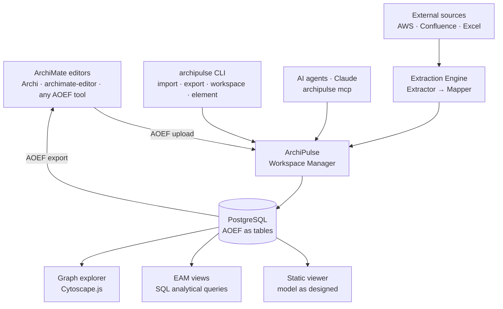
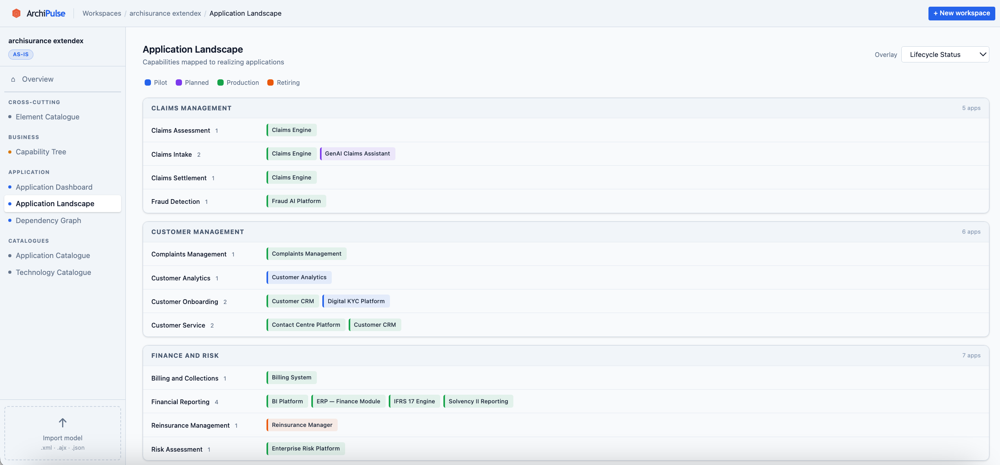
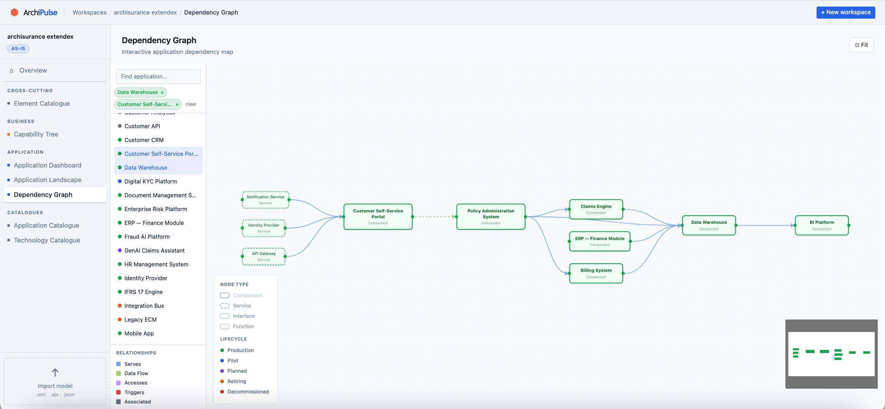
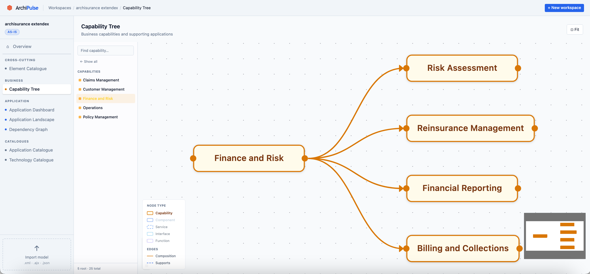

<div align="center">


# ArchiPulse

**Enterprise Architecture models without vendor lock-in.**
**Publish your ArchiMate models and explore, analyze and navigate them from a self-hosted web platform.**

Built on ArchiMate · Powered by Go · PostgreSQL · Open Source

[](https://github.com/DisruptiveWorks/archipulse/actions)
[](./LICENSE)
[](https://go.dev)
[](https://www.postgresql.org)
[](https://www.opengroup.org/archimate-forum)
[](./CONTRIBUTING.md)

[Live Demo](https://demo.archipulse.org) · [Getting Started](#getting-started) · [Features](#features) · [How It Works](#how-it-works) · [Roadmap](#roadmap) · [Contributing](#contributing) · [Support](#support)

</div>

---

> **Try it:** [demo.archipulse.org](https://demo.archipulse.org) — pre-loaded with the ArchiSurance example model. No sign-up required.

---

## What is ArchiPulse?

ArchiPulse is an open-source platform for **storing, visualizing, navigating, and analyzing ArchiMate-based Enterprise Architecture models** through a collaborative web platform.

Most EA tools today fall into one of two traps: too academic (OWL ontologies, Protégé, SPARQL) or too proprietary (vendor lock-in, closed formats, expensive licenses). ArchiPulse takes a different approach — it maps the **ArchiMate Open Exchange Format (AOEF) directly to PostgreSQL tables**, making the standard itself the data model.

The result: your architecture is not a static file but **living, collaborative data** — queryable, enrichable, versioned by baseline, and always exportable back to any AOEF-compliant tool.

ArchiPulse works alongside the tools architects already use — **Archi**, **archimate-editor**, or any AOEF-compatible tool. It adds the collaborative repository, the analytical layer, and the enrichment pipeline on top.

---

## Table of Contents

- [Features](#features)
- [How It Works](#how-it-works)
- [Screenshots](#screenshots)
- [Getting Started](#getting-started)
  - [Prerequisites](#prerequisites)
  - [Installation](#installation)
  - [Quick Start](#quick-start)
- [Supported Formats](#supported-formats)
- [Architecture](#architecture)
- [Roadmap](#roadmap)
- [Contributing](#contributing)
- [Support](#support)
- [License](#license)

---

## Features

**Collaborative Repository**
- AOEF-as-tables: the ArchiMate Open Exchange Format mapped directly to PostgreSQL — no custom metamodel
- Multiple architects edit the same workspace simultaneously — changes visible on refresh
- Optimistic locking prevents silent overwrites — conflicts shown with author and timestamp
- Semantic diff on AOEF upload — review element-by-element what changed and who changed it
- One workspace per baseline (`Q1-2026-AS-IS`, `Q1-2026-TO-BE`, `initiative-payment-modernization`)

**Viewer & Navigation**
- Static viewer — faithful reproduction of ArchiMate views as designed
- EAM views — pre-defined analytical views (capability maps, application landscapes, technology radars) generated from SQL
- Graph explorer — interactive graph with visual filters for ad-hoc dependency analysis

**Enrichment Pipeline**
- Connect real-world resource catalogs (AWS, Confluence, Excel, custom sources) to your ArchiMate workspace
- Two-stage ETL: extractors collect raw data, mappers translate it to ArchiMate element types
- Mapping rules execute against the same CRUD API used by the web interface — no special internal paths
- Community-contributed extractor library — one extractor works across all organizations

**Open & Integrable**
- Import and export any workspace as valid AOEF XML — round-trip compatible with any AOEF-compliant tool
- Full REST API — every operation available programmatically
- Self-hosted — your data stays in your infrastructure
- Compatible with Archi, archimate-editor, BiZZdesign, Sparx EA, and any AOEF-compliant tool

**CLI & AI Integration**
- `archipulse` CLI — manage workspaces, elements, relationships, diagrams, and import/export from the terminal
- MCP server (`archipulse mcp`) — connect ArchiPulse directly to Claude or any MCP-compatible AI agent; query models, run EAM views, and create or update elements through natural language

---

## How It Works



1. Architects model in their preferred tool and **upload AOEF** to ArchiPulse
2. ArchiPulse parses the model and stores it in **PostgreSQL** — one row per element, relationship, and diagram
3. Multiple architects can **edit the workspace directly** via the web interface or API — all changes are immediately visible
4. The **enrichment pipeline** pulls from external sources and maps resources to ArchiMate elements in the workspace
5. The **viewer** renders static diagrams, generates EAM analytical views, and provides an interactive graph explorer
6. Any workspace can be **exported back to AOEF** — importable into any compliant tool at any time

---

## Demo

<!-- Replace VIDEO_ID with the YouTube video ID once the demo is published -->
<!-- [](https://www.youtube.com/watch?v=VIDEO_ID) -->

> Demo video coming soon. In the meantime, try the [live demo](https://demo.archipulse.org) — no sign-up required.

---

## Screenshots

**Application Dashboard** — lifecycle and criticality breakdown across your application portfolio.

[](website/screenshots/dashboard.png)

**Application Landscape Map** — applications mapped to business capabilities with overlay filters.

[](website/screenshots/landscape.png)

**Application Dependency Graph** — interactive graph of application integrations.

[](website/screenshots/dependency-graph.png)

**Capability Tree** — hierarchical capability model with collapsible levels.

[](website/screenshots/capability-tree.png)

<!-- Additional screenshots — add image files to website/screenshots/ and uncomment -->
<!-- **Technology Stack** — application to infrastructure mapping matrix. -->
<!-- [](website/screenshots/tech-stack.png) -->

<!-- **Saved Views** — bookmarked analytical views with filter state. -->
<!-- [](website/screenshots/saved-views.png) -->

<!-- **Model Editor** — create and update elements and relationships from the web UI. -->
<!-- [](website/screenshots/model-editor.png) -->

<!-- **Snapshots** — workspace baselines for point-in-time comparison. -->
<!-- [](website/screenshots/snapshots.png) -->

---

## Getting Started

### Prerequisites

- [Docker](https://docs.docker.com/get-docker/) and Docker Compose — recommended
- Or: [Go](https://go.dev/dl/) 1.24+, [Node.js](https://nodejs.org/) 22+, [PostgreSQL](https://www.postgresql.org/download/) 17+

### Docker (recommended)

```bash
git clone https://github.com/DisruptiveWorks/archipulse.git
cd archipulse
docker compose up
```

The web interface will be available at `http://localhost:8080`.

### Manual Installation

```bash
# Clone the repository
git clone https://github.com/DisruptiveWorks/archipulse.git
cd archipulse

# Build the frontend
cd cmd/archipulse/ui && npm install && npm run build && cd ../../..

# Configure environment
cp .env.example .env
# Edit .env — set DATABASE_URL

# Run database migrations
go run ./cmd/archipulse migrate

# Build and run
go build -o archipulse ./cmd/archipulse
./archipulse serve
```

### Quick Start

```bash
# Create a workspace
curl -X POST http://localhost:8080/api/v1/workspaces \
  -H "Content-Type: application/json" \
  -d '{"name": "Q1-2026-AS-IS", "purpose": "as-is"}'

# Import an ArchiMate model
curl -X POST http://localhost:8080/api/v1/workspaces/{id}/import \
  -F "file=@examples/archisurance.xml"

# Open the viewer
open http://localhost:8080
```

ArchiPulse ships with the **ArchiSurance** example model from The Open Group so you can explore the viewer immediately.

---

## Supported Formats

| Format | Import | Export | Notes |
|---|---|---|---|
| ArchiMate Open Exchange Format (AOEF) | ✅ | ✅ | Official Open Group standard · XSD validated |
| CSV | 🔜 | ✅ | Catalog export for manual workflows |
| Archi native (`.archimate`) | 📋 Backlog | — | Via community contribution |

---

## Architecture

ArchiPulse is built around a single core insight: **the ArchiMate Open Exchange Format already defines what entities exist — map them directly to PostgreSQL tables.**

This means export is a SELECT, import is an INSERT, and collaboration is database-native. No custom metamodel, no graph database, no vendor lock-in.

**Repository structure:**

```
archipulse/
├── cmd/
│   └── archipulse/
│       ├── ui/           # Svelte 5 + Vite 6 frontend
│       │   └── src/      # Components, routes, lib
│       ├── embed.go      # //go:embed ui/dist
│       └── main.go       # serve · migrate · seed · CLI · MCP entry points
├── internal/
│   ├── parser/           # AOEF parser with ArchiMate structural validation
│   ├── exporter/         # AOEF export (SELECT → XML)
│   ├── workspace/        # Workspace CRUD
│   ├── element/          # Element CRUD
│   ├── relationship/     # Relationship CRUD
│   ├── diagram/          # Diagram CRUD
│   ├── viewer/           # EAM view generation (SQL queries)
│   │   └── views/        # Individual view implementations
│   ├── api/              # REST API handlers
│   ├── auth/             # JWT + OIDC authentication
│   ├── audit/            # Audit log / workspace events
│   ├── cli/              # archipulse CLI commands
│   ├── mcpserver/        # MCP server (AI agent integration)
│   ├── savedviews/       # Saved views with filter state
│   └── snapshot/         # Workspace snapshots / baselines
├── migrations/           # PostgreSQL migrations
└── examples/             # Sample ArchiMate models (ArchiSurance, ArchiMetal)
```

---

## Roadmap

### v0.1 — Foundation ✅
- [x] AOEF parser with ArchiMate structural validation
- [x] PostgreSQL schema (AOEF as tables)
- [x] Workspace, element, relationship, diagram CRUD API
- [x] Optimistic locking on all editable resources
- [x] AOEF export (round-trip compatible)
- [x] CI pipeline and test suite

### v0.2 — Viewer & Navigation ✅
- [x] Embedded SPA frontend (single binary, no runtime deps)
- [x] Static AOEF viewer — faithful reproduction of ArchiMate diagrams
- [x] EAM views: Element Catalogue, Application Catalogue, Application Landscape, Technology Catalogue
- [x] Application Dependency Graph
- [x] Capability Tree view
- [x] Docker Compose setup

### v0.3 — EAM Views ✅
- [x] Integration Map (application integration topology)
- [x] Process–Application matrix
- [x] Capability Landscape
- [x] Technology Catalogue

### v0.4 — Frontend ✅
- [x] Svelte 5 + Vite 6 component-based frontend
- [x] Corporate Light theme — professional enterprise UI
- [x] Application Dashboard with lifecycle/criticality charts
- [x] Application Dependency Graph (interactive, filterable)

### v0.5 — Collaboration ✅
- [x] Import preview — two-step semantic diff before confirming any import
- [x] Model Editor — create and update elements and relationships from the web UI
- [x] Saved views — bookmark analytical views with filter state
- [x] Audit log — per-workspace event history

### v0.6 — Platform ✅
- [x] Stable, paginated REST API
- [x] Multi-user authentication (JWT + OIDC)
- [x] `archipulse` CLI — workspaces, elements, relationships, diagrams, import/export
- [x] MCP server — AI agent integration via stdio (`archipulse mcp`)
- [x] Technology Stack view (app → infrastructure matrix)

### v0.7 — Analysis _(in progress)_
- [ ] Capability Gap Analysis (capability coverage heatmap)
- [ ] Interface Catalogue
- [ ] User management UI (invitations, roles, password reset)

### v1.0 — Production Ready
- [ ] Helm chart for Kubernetes deployment
- [ ] Full documentation site at archipulse.org
- [ ] Extractor library (AWS, Azure, Confluence, ServiceNow, Jira)
- [ ] Hosted SaaS and enterprise support

> The roadmap is managed publicly via [GitHub Milestones](https://github.com/DisruptiveWorks/archipulse/milestones). Community input is welcome in [Discussions](https://github.com/DisruptiveWorks/archipulse/discussions).

---

## Contributing

Contributions of all kinds are welcome.

Especially impactful right now:

- **Extractors** — connectors for data sources your organization uses (AWS, Azure, Jira, Confluence, ServiceNow...)
- **EAM view queries** — SQL queries that generate meaningful analytical views from ArchiMate models
- **Web frontend** — new views, UX improvements, accessibility
- **Documentation** — deployment guides, usage tutorials, worked examples

Please read [CONTRIBUTING.md](./CONTRIBUTING.md) to get started.

Good entry points: [`good first issue`](https://github.com/DisruptiveWorks/archipulse/labels/good%20first%20issue) · [`help wanted`](https://github.com/DisruptiveWorks/archipulse/labels/help%20wanted) · [`extractor`](https://github.com/DisruptiveWorks/archipulse/labels/extractor)

---

## Support

ArchiPulse is developed and maintained by [Disruptive Works](https://disruptive-works.com) and released free and open source under the Apache 2.0 license.

**Self-hosted** — free forever. Clone the repo, run Docker Compose, and own your data completely.

**Hosted SaaS** _(coming soon)_ — a fully managed ArchiPulse instance with no infrastructure to manage. Join the waitlist at [archipulse.org](https://archipulse.org).

**Enterprise support** _(coming soon)_ — dedicated onboarding, private deployments, SLA-backed support, and custom extractor development. If you're interested, reach out early at [hello@disruptive-works.com](mailto:hello@disruptive-works.com).

Other ways to support the project:

- **Star the repository** — helps with visibility
- **Report issues and suggest features** — your feedback shapes the roadmap
- **Contribute code, documentation, or extractors** — see [CONTRIBUTING.md](./CONTRIBUTING.md)

---

## License

ArchiPulse is licensed under the [Apache License 2.0](./LICENSE).

ArchiMate® is a registered trademark of The Open Group. ArchiPulse is an independent project and is not affiliated with or endorsed by The Open Group.

---

<div align="center">
  <sub>Built with care by <a href="https://github.com/DisruptiveWorks">Disruptive Works</a> · <a href="https://archipulse.org">archipulse.org</a></sub>
</div>
