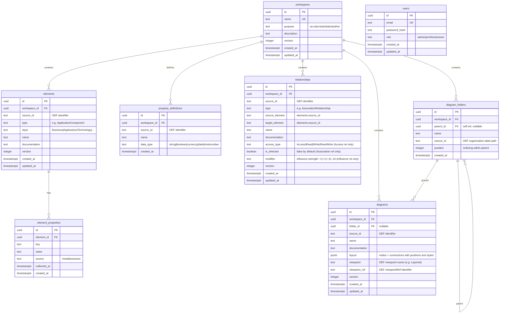

# Database Schema

ArchiPulse uses PostgreSQL. All tables are created and updated via numbered SQL migrations in [`migrations/`](../migrations/).

## Entity-Relationship Diagram



## Notes

### `layout` JSON structure (diagrams)

The `layout` column is a JSONB blob produced by the parser. Its structure mirrors the OEF diagram visual model:

```json
{
  "Nodes": [
    {
      "ElementID": "id-app-001",
      "ParentElementID": "",
      "NodeType": "Element",
      "X": 120, "Y": 80, "W": 120, "H": 55,
      "Style": {
        "FillColor": { "R": 255, "G": 251, "B": 235, "A": null },
        "LineColor": { "R": 217, "G": 119, "B": 6 },
        "Font": { "Name": "Arial", "Size": "9", "Style": "plain", "Color": null },
        "LineWidth": 1
      }
    }
  ],
  "Connections": [
    {
      "RelationshipID": "id-rel-001",
      "Label": "",
      "Bendpoints": [{ "X": 180, "Y": 108 }],
      "Style": null
    }
  ]
}
```

- **`Style`** is stored as parsed from the OEF file and is available for future custom rendering. ArchiPulse's current theme uses its own colour palette and ignores `Style.FillColor`/`Style.LineColor` by default.
- **`NodeType`** reflects the OEF `xsi:type` on each node (`Element`, `Container`, `Label`, etc.).

### Relationship semantic attributes

Three columns capture OEF type-specific semantics that affect how relationships are rendered:

| Column | Applies to | Values |
|---|---|---|
| `access_type` | `AccessRelationship` | `Access` (default) · `Read` · `Write` · `ReadWrite` |
| `is_directed` | `AssociationRelationship` | `false` (default) · `true` |
| `modifier` | `InfluenceRelationship` | `+` · `++` · `-` · `--` · `0`–`10` |

### Property definitions

OEF `<propertyDefinition>` entries are stored workspace-scoped in `property_definitions`. The `data_type` column records the declared type (`string`, `boolean`, `currency`, `date`, `time`, `number`), enabling typed property editing in a future editor feature.

### `source_id` vs `id`

Every ArchiMate concept table has both an `id` (internal UUID, stable across re-imports) and a `source_id` (the original identifier from the OEF/AJX file). Re-importing the same model is idempotent via `ON CONFLICT (workspace_id, source_id) DO UPDATE`.
```
